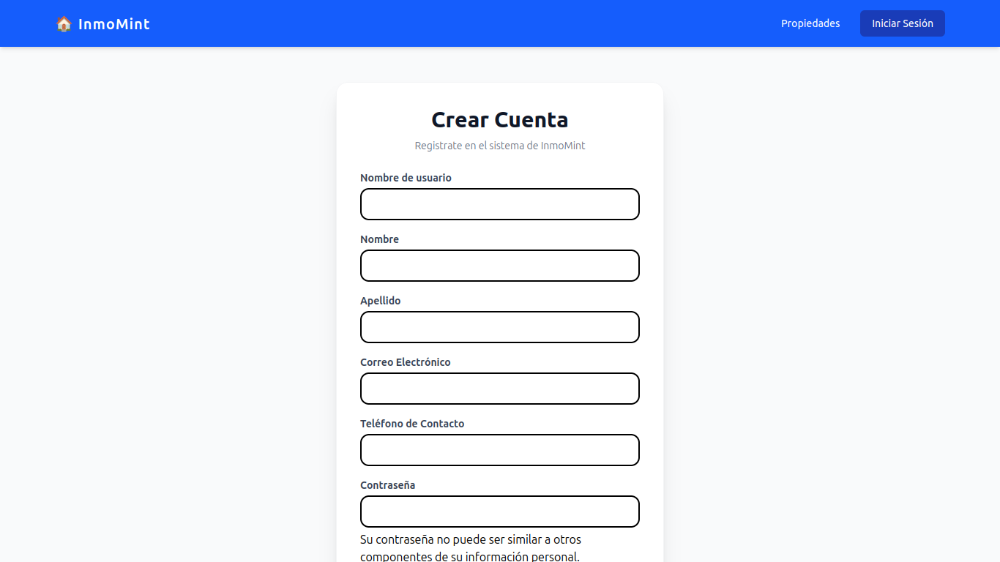
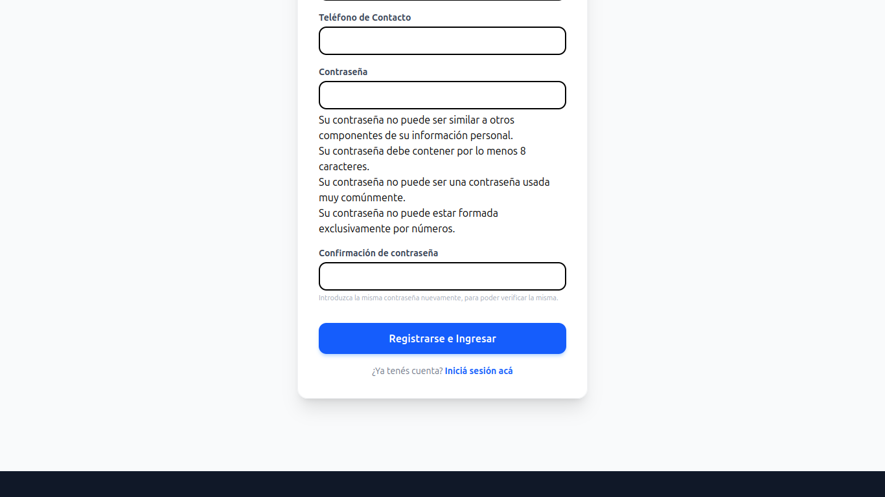
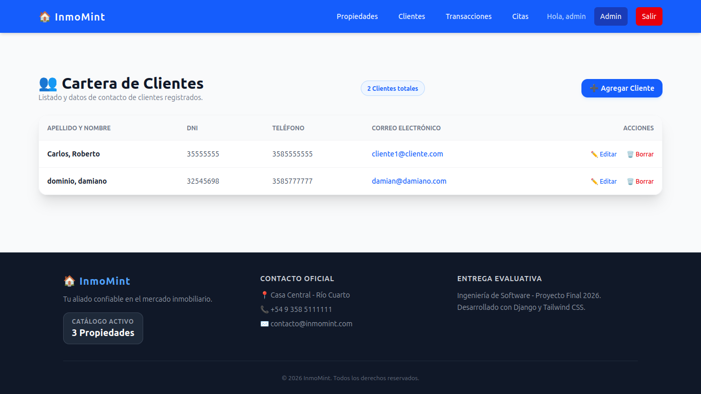
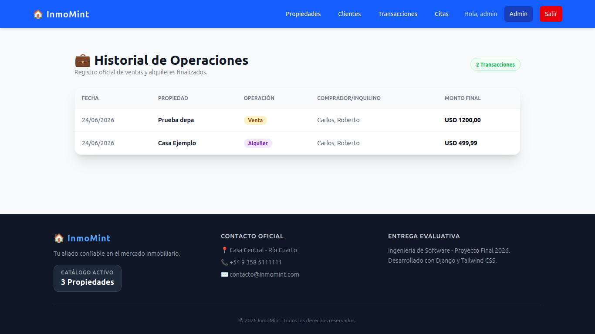
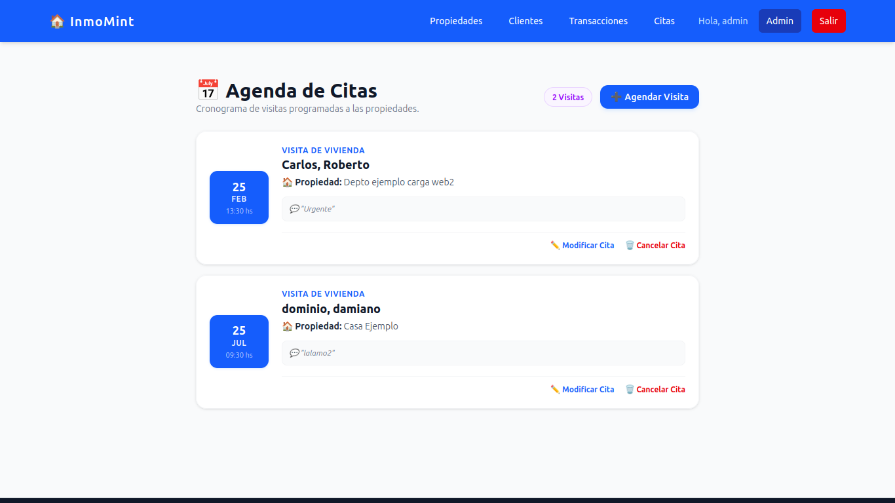
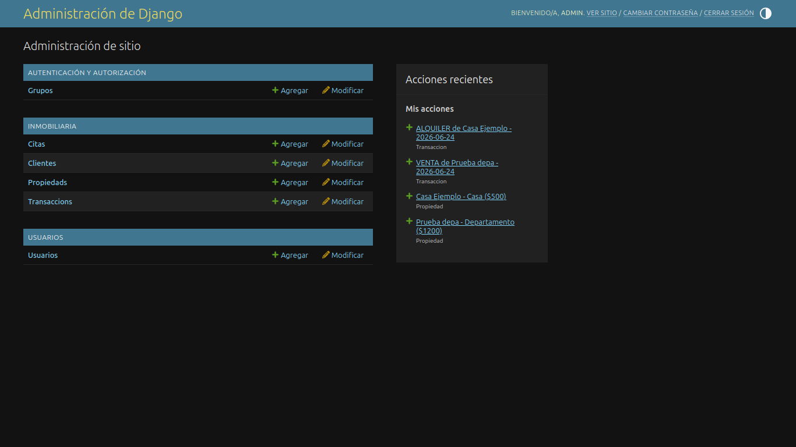
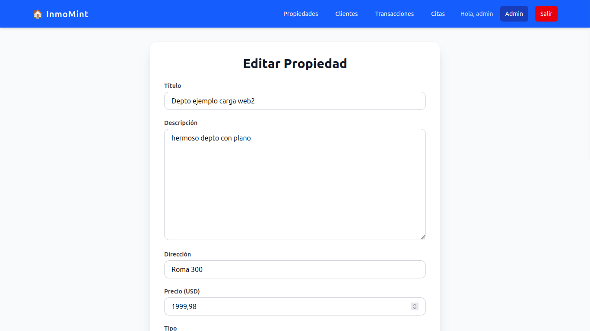
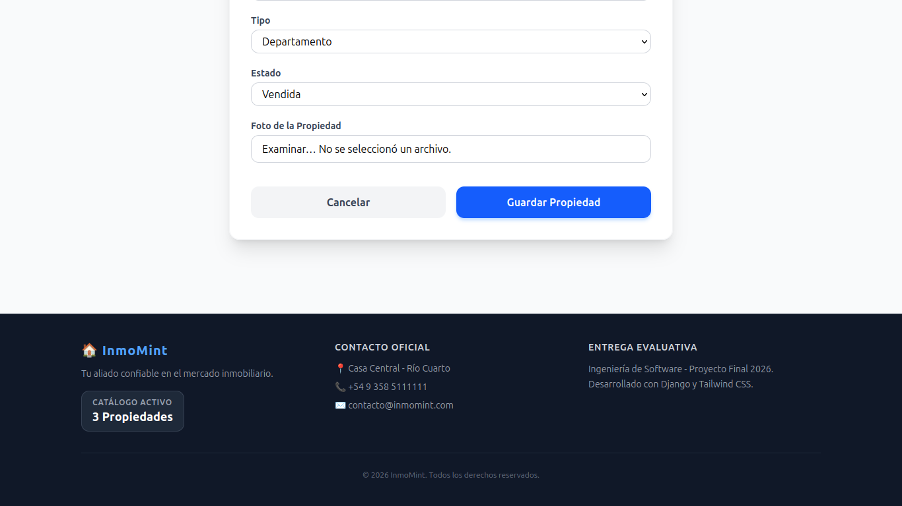
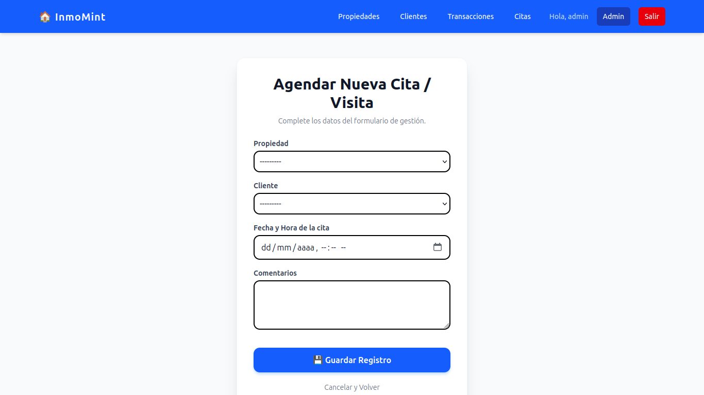
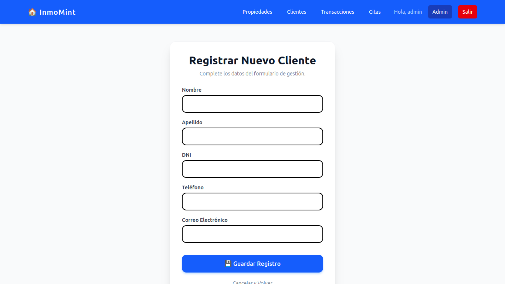

# 🏠 InmoMint - Sistema de Gestión Inmobiliaria

Un sistema de gestión integral para inmobiliarias desarrollado en Django, diseñado para administrar propiedades, gestionar la cartera de clientes, registrar transacciones y coordinar la agenda de citas y visitas a las viviendas.

---

## 🚀 Requisitos Técnicos Cumplidos (Consigna)

### 📊 Base de Datos y Modelos
El sistema implementa **6 modelos** estructurados y relacionados mediante llaves foráneas (`ForeignKey`):
* **UsuarioPersonalizado:** Extiende de `AbstractUser` para centralizar la autenticación de agentes.
* **Propiedad:** Almacena los inmuebles (Casas, Departamentos, Terrenos, Locales).
* **ImagenPropiedad:** Manejo dinámico de fotos mediante `ImageField` con subida organizada a la carpeta de medios.
* **Cliente:** Registro de datos de contacto de clientes.
* **Cita:** Turnero dinámico para registrar visitas planificadas a las propiedades.
* **Transaccion:** Historial contable y de contratos vinculando propiedades, clientes y agentes.

### 🔐 Seguridad y Permisos por Grupo
* **Vistas de Lectura (Read):** Protegidas globalmente con el decorador `@login_required`. Solo los usuarios autenticados pueden ver los listados de clientes, transacciones y citas.
* **Vistas de Escritura (CRUD):** Protegidas de forma estricta mediante pruebas de usuario (`@user_passes_test`). Las acciones de creación, modificación y eliminación quedan reservadas con exclusividad para **Administradores** o usuarios con el rol `es_agente=True` (pertenecientes al Grupo de Agentes).

### ⚙️ Panel de Administración Avanzado
El panel `/admin/` fue extendido utilizando configuraciones avanzadas de Django para otorgar control absoluto:
* **Búsquedas:** Mapeadas por texto libre y campos relacionados (`propiedad__titulo`, `cliente__apellido`).
* **Filtros directos:** Filtrado inmediato por tipo de inmueble, estado de disponibilidad u operaciones.
* **Ordenamiento por defecto:** Listados ordenados automáticamente de forma intuitiva (por fecha decreciente o precio).
* **Inlines:** Carga simultánea de imágenes directamente desde el formulario de creación de la propiedad.

### 🛠️ Configuración Adicional
* Uso de **Context Processor** personalizado para inyectar metadatos generales de forma global a los templates (usado en los datos del footer y el contador de propiedades).
* Traducción completa del sistema al español (`es-ar`) y configuración de zona horaria de Argentina.

---

## 📸 Capturas de Pantalla

### 1. Home (y Footer) (Publico)


### Loguin Form


### Register Form



### Propiedades con Cards personalizadas (RegisterUser/Adm Only)
##### Vista User
.png)
# Vista Adm


### Detalle de cada propiedad (RegisterUser/Adm Only)
##### Vista Adm


### Cartera de Clientes (RegisterUser/Adm Only)
##### Vista Adm


### Transacciones (RegisterUser/Adm Only)
##### Vista Adm


### Citas (RegisterUser/Adm Only)
##### Vista Adm


### Panel de Administrador (dm Only)


### Formularios y extras
#### Warning eliminar (admin only)

#### Formulario editar propiedad (admin only)


#### Formulario Citas (RegisterUser/Adm only)

#### Formulario Clientes (RegisterUser/adm only)

---

## 🛠️ Instalación y Ejecución Local

1. Clonar el repositorio:
   ```bash
   git clone [https://github.com/TU_USUARIO/TU_REPOSITORIO.git](https://github.com/TU_USUARIO/TU_REPOSITORIO.git)
   cd TU_REPOSITORIO

## Alumno
### Bressan Nadal Franco Nicolas